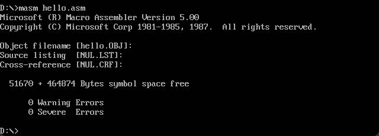
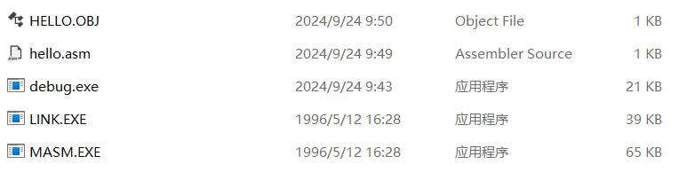
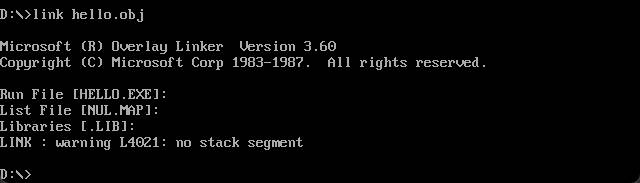
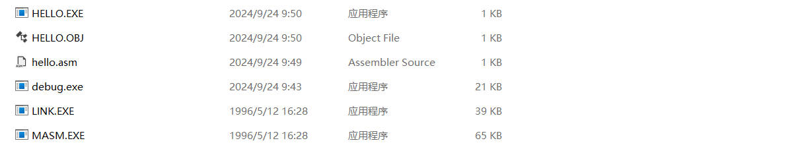
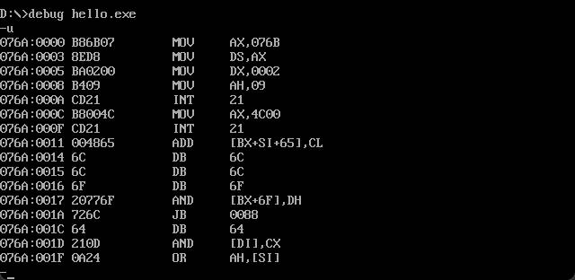
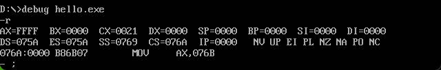
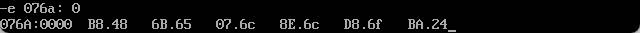
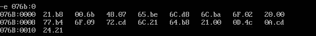
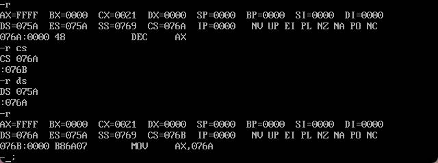

# Hello World 

同济大学 2022级 计算机科学与技术学院 软件工程专业 嵌入式系统方向 汇编语言课程作业

授课教师：王冬青

授课学期：2024-2025年度 秋季学期

2251730 刘淑仪

## 传统编译方式

### 环境配置

1. 安装 [`DOSBOX`](https://sourceforge.net/projects/dosbox/)，安装完毕后，另外创建文件夹用于存放汇编语言所需要的编译配件。本人将其命名为 `ASM_Tools` 。

2. 在 `DOSBOX `安装目录中，打开`DOSBox 0.74 Options.bat` ，末尾添加如下内容设置编译虚拟环境。（此步骤非必要，但如果不做的话，需要每次启动`DOSBOX` 都输入一遍该 `mount` 指令）

```
[autoexec]
# Lines in this section will be run at startup.
# You can put your MOUNT lines here.
mount d d:\ASM_Tools
d:
```

3. 在该文件夹下添加`LINK.EXE` ， `debug.exe` ， `MASM.EXE` （均在学院服务器获得）


### 创建 `.asm` 文件

1. 在 `ASM_Tools` 文件下创建 `hello.asm`，并添加简单的 `hello world` 程序（学院服务器也提供源代码）

```asm
.model small
.data
Hello	DB 'Hello world!',0dh,0ah,'$'
.code
START:
	MOV	AX,@DATA
	MOV DS,AX
	MOV DX,offset Hello
	MOV AH,9
	INT	21H

	MOV	AX,4C00H
	INT 21h
END START
```

### 编译及运行 `hello world` 程序

1. 在 `DOSBOX` 中输入命令 `masm hello.asm` ，调用 `MASM.EXE` 编译程序，一路回车即可，得到 `hello.obj`。





2. 在 `DOSBOX` 中输入命令 `link hello.obj` 或者直接 `link hello` ，调用 `LINK.EXE` 链接程序，同样一路回车即可，得到 `HELLO.EXE`。





3. 输入命令 `hello`，执行 `HELLO.EXE`。


4. 通过使用 `debug` 指令对 `EXE` 文件进行反汇编。在 `DOSBOX` 中输入 `debug hello.exe`，然后使用 `-u` 指令查看反汇编结果。



## 内存写入数据方式

学习学院服务器下的 **hello剖析.pdf** 文件中对hello的另类执行方式，并在本地复现。

### 使用 `debug` 并查看寄存器

输入 `debug hello.exe`，`-r` 命令查看寄存器。



### 写数据及机器码到内存

1. 写数据：使用 `-e 076a: 0` 命令，将“Hello$"对应的ASCII码 `48 65 6c 6c 6f 24` 写入内存。



2. 写机器码：使用 `‐e 076b: 0` 命令，将代码的机器码 `b8 6a 07 8e d8 b4 09 ba 00 00 cd 21 b8 00 4c cd 21` （17个字节）写入内存。



### 修改寄存器及执行

1. 通过 `-r` 查看及修改对应的寄存器
其中 `DS` 为数据段，`CS` 为代码段，其余暂不重要。



2. 输入 `-g` 执行。

