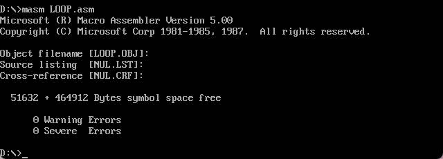
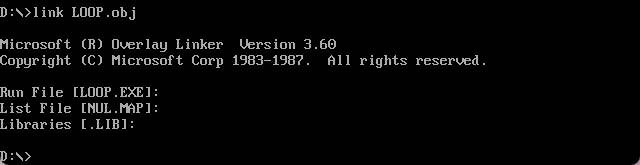
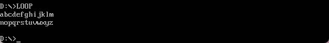
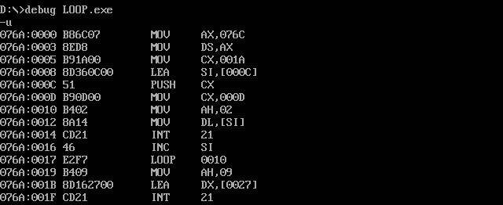
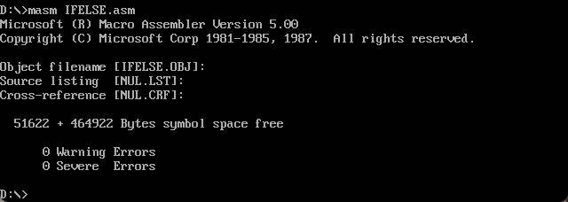
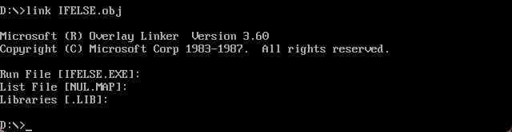
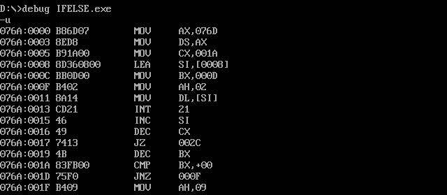
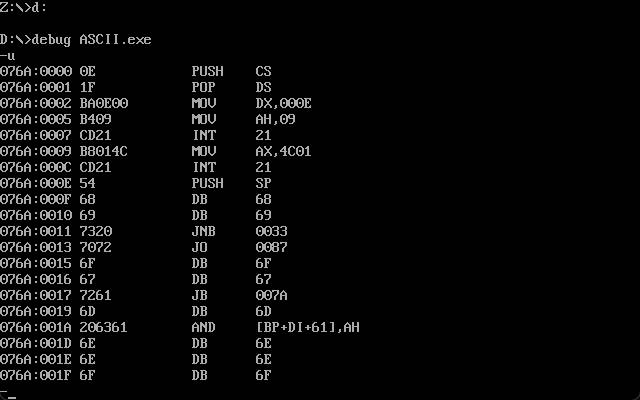

# ASCII

同济大学 2022级 计算机科学与技术学院 软件工程专业 嵌入式系统方向 汇编语言课程作业

授课教师：王冬青

授课学期：2024-2025年度 秋季学期

2251730 刘淑仪

## loop指令实现

### 源代码

```assembly
.MODEL SMALL
.STACK 100h
.DATA
    letters DB 'abcdefghijklmnopqrstuvwxyz$'
    newline DB 0Dh, 0Ah, '$'

.CODE
MAIN PROC
    MOV AX, @DATA
    MOV DS, AX

    MOV CX, 26
    LEA SI, letters

outer_loop:
    PUSH CX
    MOV CX, 13

print_letters_loop:
    MOV AH, 02h
    MOV DL, [SI]
    INT 21h
    INC SI
    LOOP print_letters_loop

    MOV AH, 09h
    LEA DX, newline
    INT 21h

    POP CX
    SUB CX, 13
    JNZ outer_loop

    MOV AH, 4Ch
    INT 21h

MAIN ENDP
END MAIN
```
### 编译并运行







### 反汇编查看



## 条件跳转指令实现

### 源代码

```assembly
.MODEL SMALL
.STACK 100h
.DATA
    letters DB 'abcdefghijklmnopqrstuvwxyz$'  
    newline DB 0Dh, 0Ah, '$'                  

.CODE
MAIN PROC
    MOV AX, @DATA
    MOV DS, AX

    MOV CX, 26                                
    LEA SI, letters                           

    MOV BX, 13                                

print_letters_conditional:
    MOV AH, 02h                               
    MOV DL, [SI]                              
    INT 21h                                   

    INC SI                                    
    DEC CX                                    
    JZ end_loop                               

    DEC BX                                    
    CMP BX, 0                                 
    JNE print_letters_conditional             

    MOV AH, 09h                               
    LEA DX, newline                           
    INT 21h                                   
    MOV BX, 13                                

    JMP print_letters_conditional             

end_loop:
    MOV AH, 09h
    LEA DX, newline
    INT 21h

    MOV AH, 4Ch                               
    INT 21h

MAIN ENDP
END MAIN
```

### 编译并运行






### 反汇编查看



## 用C语言实现后察看反汇编代码并加注释

### C语言代码

```c
#include <stdio.h>

int main() {
    char start = 'a';
    char end = 'z';
    int count = 0;

    for (char c = start; c <= end; c++) {
        printf("%c ", c); 
        count++; 

        if (count == 13) {
            printf("\n");
            count = 0;
        }
    }

    if (count != 0) {
        printf("\n");
    }

    return 0;
}
```

### 反汇编编译



```assembly
076A:0000  0E           PUSH    CS       ; 将代码段寄存器 CS 压入堆栈，以备后续使用。
076A:0001  1F           POP     DS       ; 从堆栈弹出 CS（现在是CS的值）到数据段寄存器 DS，这样可以在后续操作中使用相同的段。
076A:0002  BA0E00       MOV     DX,000E  ; 将内存地址偏移量 0x000E 载入寄存器 DX，该地址指向要显示的字符串。
076A:0005  B409         MOV     AH,09    ; 将 09h 载入 AH，功能号 09h 表示 DOS 的显示字符串功能（中断 21h）。
076A:0007  CD21         INT     21       ; 调用 DOS 中断 21h，输出 DX 指向的字符串，显示到屏幕上，直到遇到字符串结束符 '$'。
076A:0009  B8014C       MOV     AX,4C01  ; 将 4C01h 载入 AX，4C 是中断 21h 的功能号，用于正常终止程序，01 是返回的退出代码。
076A:000C  CD21         INT     21       ; 调用 DOS 中断 21h，终止程序并返回退出代码 01。
076A:000E  DB 68        ; 定义字节，字符 'h' 的 ASCII 值为 0x68
076A:000F  DB 69        ; 定义字节，字符 'i' 的 ASCII 值为 0x69
076A:0010  DB 20        ; 定义字节，空格字符的 ASCII 值为 0x20
076A:0011  DB 41        ; 定义字节，字符 'A' 的 ASCII 值为 0x41
076A:0012  DB 53        ; 定义字节，字符 'S' 的 ASCII 值为 0x53
076A:0013  DB 43        ; 定义字节，字符 'C' 的 ASCII 值为 0x43
076A:0014  DB 49        ; 定义字节，字符 'I' 的 ASCII 值为 0x49
076A:0015  DB 49        ; 定义字节，字符 'I' 的 ASCII 值为 0x49
076A:0016  DB 20        ; 定义字节，空格字符的 ASCII 值为 0x20
076A:0017  DB 54        ; 定义字节，字符 'T' 的 ASCII 值为 0x54
076A:0018  DB 65        ; 定义字节，字符 'e' 的 ASCII 值为 0x65
076A:0019  DB 73        ; 定义字节，字符 's' 的 ASCII 值为 0x73
076A:001A  DB 74        ; 定义字节，字符 't' 的 ASCII 值为 0x74
076A:001B  DB 24        ; 定义字节，字符串结束符 `$`
```

## 实验心得

通过这段代码，我学到了以下几点：

1. 汇编指令的基础操作：在代码中使用了汇编语言中的基本指令如 MOV, INT, LOOP, PUSH, POP, CMP, JMP 等。这让我熟悉了汇编指令如何操作寄存器、内存、栈以及如何调用中断服务。通过这些指令，我加深了对数据传递、循环控制和条件跳转的理解。

2. DOS中断调用的使用：代码中多次使用了 INT 21h 中断来实现字符输出和程序终止。让我了解到 DOS 中断系统如何工作，尤其是 AH=02h 用于输出字符，AH=09h 用于输出字符串，以及 AH=4Ch 用于结束程序的功能。

3. 循环控制与流程优化：通过 LOOP 指令和条件跳转指令的对比，我认识到不同的循环方式在性能和灵活性上的差异。例如，LOOP 依赖于 CX 寄存器的递减操作，而条件跳转指令则通过手动调整寄存器和标志位进行循环控制，更具灵活性。

4. 反汇编与机器语言的对应关系：通过将 C 语言代码反汇编并注释，我学会了如何通过反汇编理解高级语言代码在底层的执行过程。这让我认识到高级语言中的结构化逻辑（如 for 循环）是如何通过简单的指令序列在机器中实现的，并加深了对程序执行效率的理解。

5. 汇编与高级语言的对比学习：在将汇编与C语言代码进行对比时，我体会到了汇编语言的精细控制和灵活性，同时也感受到高级语言在编程简洁性和可读性上的优势。汇编提供了对底层硬件的直接访问，而高级语言则提供了抽象层，方便编程。