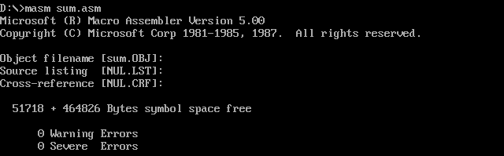
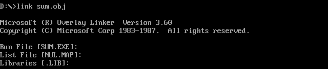
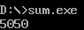
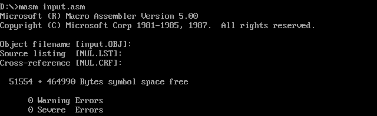
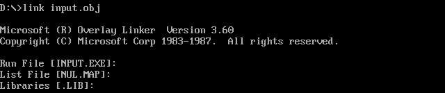
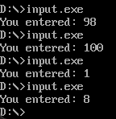
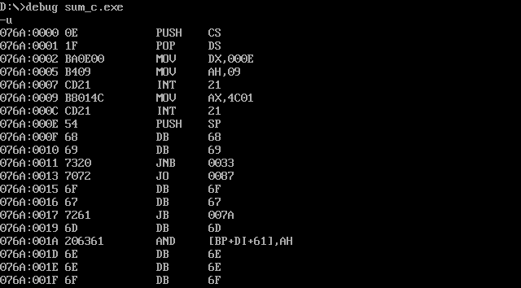
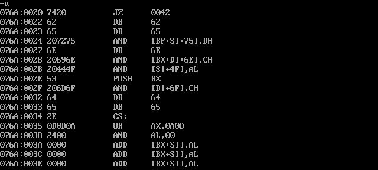
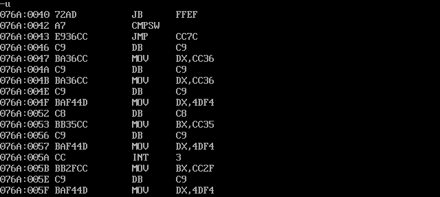

# SUM

同济大学 2022级 计算机科学与技术学院 软件工程专业 嵌入式系统方向 汇编语言课程作业

授课教师：王冬青

授课学期：2024-2025年度 秋季学期

2251730 刘淑仪

## 求 1+2+......+100，并将结果“5050”打印到屏幕

### 源代码

```assembly
.MODEL SMALL   ; 定义小型模型
.STACK 100h    ; 设置堆栈大小为 256 字节

.DATA           ; 数据段开始
    I DB ?      ; 用于存储结果
    Result DB ? ; 用于存储计算结果

.CODE           ; 代码段开始
START:          
    MOV AX, @DATA  ; 将数据段地址加载到 AX
    MOV DS, AX     ; 初始化数据段寄存器
    MOV CX, 100    ; CX = 100
    MOV AX, 0      ; AX = 0

; --------------------------
; 将结果放在寄存器中
; --------------------------
A1: 
    ADD AX, CX     ; AX += CX
    LOOP A1        ; CX -= 1，循环直到 CX = 0

; 保存结果在寄存器中（AX）
    ; 这里可以直接使用 AX，AX 的值是我们计算的结果

; --------------------------
; 将结果放在数据段中
; --------------------------
    MOV Result, AL ; 将 AL 的值存入数据段变量 Result

; --------------------------
; 将结果放在栈中
; --------------------------
    PUSH AX        ; 将 AX 压入堆栈

    MOV CX, 10     ; CX = 10
    MOV BX, 10000  ; BX = 10000

A2: 
    XOR DX, DX     ; 清零 DX
    MOV AX, BX     ; AX = BX
    DIV CX         ; AX 除以 CX，结果在 AX，余数在 DX
    CMP AX, 0      ; 比较 AX 和 0
    JL S           ; 如果 AX < 0，跳转到 S
    JE S           ; 如果 AX = 0，跳转到 S
    
    MOV BX, AX     ; 将 AX 的值存入 BX
    XOR DX, DX     ; 清零 DX
    POP AX         ; 从堆栈弹出 AX
    DIV BX         ; AX 除以 BX
    PUSH DX        ; 将余数推入栈
    ADD AL, 30H    ; 将 AL 转换为 ASCII
    MOV DL, AL     ; DL = AL
    MOV AH, 2      ; 准备调用 DOS 打印字符
    INT 21H        ; 调用 DOS 中断打印字符
    JMP A2         ; 跳回 A2

S:    
    MOV AH, 4CH    ; 结束程序
    INT 21H        ; 调用 DOS 中断退出程序

END START        ; 程序结束
```
### 编译并运行







## 用户输入 1~100 内的任何一个数，完成十进制结果输出

### 源代码

```assembly
.MODEL SMALL
.STACK 100h

.DATA
    InputBuffer DB 10, 0 ; 输入缓冲区大小，第二个字节初始为0
    DB 10 DUP(0)         ; 分配10个字节的空间来存放用户输入的字符
    Msg DB 'You entered: $' ; 提示消息
    Number DB 3 DUP(0)   ; 用于存储用户输入的数字（最多3位数）

.CODE
START:
    MOV AX, @DATA        ; 初始化数据段
    MOV DS, AX

    ; 输入字符
    MOV DX, OFFSET InputBuffer ; 将缓冲区地址放入 DX
    MOV AH, 0AH           ; 使用功能号 0AH 读取字符串
    INT 21H               ; 调用 DOS 中断

    ; 输出结果前，清零 Number 数组
    MOV DI, OFFSET Number ; DI 指向 Number 数组
    MOV CX, 0             ; 计数器

    ; 将输入的字符转换为十进制数字
    MOV CL, [InputBuffer + 1] ; 获取输入的字符数量
    MOV SI, OFFSET InputBuffer + 2 ; SI 指向输入字符开始的位置

ConvertLoop:
    ; 检查输入字符的数量
    CMP CX, 0              ; 如果 CX <= 0，结束转换
    JE OutputResult

    ; 将字符转换为数字
    MOV AL, [SI]           ; 读取当前字符
    SUB AL, '0'            ; 转换为数字
    MOV [DI], AL           ; 存储数字
    INC DI                 ; 移动到下一个存储位置
    INC SI                 ; 移动到下一个输入字符
    DEC CX                 ; 减少字符计数
    JMP ConvertLoop

OutputResult:
    ; 输出结果
    MOV AH, 09H            ; 准备输出字符串
    MOV DX, OFFSET Msg      ; 将消息地址放入 DX
    INT 21H                 ; 输出提示消息

    ; 重新准备输出数字
    MOV DI, OFFSET Number   ; DI 指向 Number 数组
    MOV CL, [InputBuffer + 1] ; 获取输入的字符数量

PrintLoop:
    CMP CL, 0              ; 检查是否还有字符要输出
    JE EndProgram          ; 如果没有，结束程序

    ; 转换数字回字符并输出
    MOV AL, [DI]           ; 读取数字
    ADD AL, '0'            ; 转换为字符
    MOV DL, AL             ; 将字符放入 DL
    MOV AH, 02H            ; 准备输出字符
    INT 21H                ; 输出字符

    INC DI                 ; 移动到下一个数字
    DEC CL                 ; 减少字符计数
    JMP PrintLoop          ; 继续输出

EndProgram:
    ; 结束程序
    MOV AX, 4C00h          ; 退出程序
    INT 21H

END START
```

### 编译并运行







## 用C语言实现后察看反汇编代码并加注释

### C语言代码

```c
#include <stdio.h>

int main() {
    int sum = 0; // 初始化 sum 变量为 0
    for (int i = 1; i <= 100; i++) { // 循环从 1 到 100
        sum += i; // 将当前 i 加到 sum 中
    }
    printf("%d\n", sum); // 打印 sum 的值
    return 0; // 返回 0 表示程序正常结束
}
```

### 反汇编编译







```assembly
PUSH CS            ; 将当前代码段寄存器的值压入栈中
POP DS             ; 从栈中弹出一个值并存储到数据段寄存器（DS）

MOV DX, 000E      ; 将常数 000E 移动到数据寄存器 DX 中
MOV AH, 09        ; 将 09 移动到寄存器 AH 中，通常用于输出字符串

INT 21            ; 调用 DOS 中断 21h，处理系统调用，如输出字符串

MOV AX, 4C01      ; 将 4C01 移动到 AX 寄存器，通常用于正常退出程序
INT 21            ; 再次调用 DOS 中断 21h，用于程序的正常退出

PUSH SP           ; 将堆栈指针（SP）的值压入栈中

; 定义字节（ASCII 字符或数据）
DB 68              ; 字节 68
DB 69              ; 字节 69
DB 68              ; 字节 68
DB 6F              ; 字节 6F
DB 62              ; 字节 62
DB 65              ; 字节 65
DB 6E              ; 字节 6E
DB 61              ; 字节 61
DB 6E              ; 字节 6E

JNB 0033          ; 如果无进位标志（CF）被设置，则跳转到地址 0033
JO 0087           ; 如果有溢出标志（OF）被设置，则跳转到地址 0087
JB 007A           ; 如果 CF 被设置，则跳转到地址 007A

AND [BP+DI+611], AH ; 对内存地址 [BP+DI+611] 中的值与 AH 寄存器的值进行按位与操作

OR AX, 0AOD      ; 将 AX 寄存器与 0AOD 进行按位或操作，通常用于设置特定位

ADD [BX+SI+1], AL ; 将 AL 寄存器中的值加到内存地址 [BX+SI+1] 中的值

INT 3            ; 调用中断 3，通常用于调试
```

## 实验心得

在本次实验中，我深入学习了汇编语言中的数据输入与输出操作，具体体现在以下几个方面：

1. **字符输入处理**：我通过使用 DOS 中断（INT 21H）的功能实现了用户输入字符的功能。特别是使用功能号 0AH 来读取字符串，让我体验到了如何通过缓冲区存储用户输入的内容。程序首先设置一个输入缓冲区，通过读取字符的方式将用户输入的数字保存到内存中。这一过程让我理解了输入操作在汇编语言中是如何通过中断与系统调用来实现的，增加了我对底层输入机制的认识。

2. **数字转换与存储**：在读取用户输入后，程序通过循环将输入的字符转换为对应的十进制数字。每个字符在被读取后，经过减去 ASCII 值 '0' 的操作，转换为其对应的数值，并存储到一个数组中。这个过程让我意识到数据转换的重要性，并锻炼了我对数据类型和内存存储的理解。

3. **输出结果**：通过调用另一个 DOS 中断（INT 21H）实现了输出功能，我将用户输入的结果以字符串形式显示在屏幕上。在输出数字时，程序又将存储的数字转换回字符格式（通过加上 '0'），并逐个输出。这个过程不仅增强了我对字符和数字在计算机内存中表示方式的理解，也让我体会到了程序如何实现从数据存储到用户界面的完整流程。