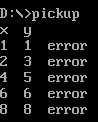

# Multiplication Table

同济大学 2022级 计算机科学与技术学院 软件工程专业 嵌入式系统方向 汇编语言课程作业

授课教师：王冬青

授课学期：2024-2025年度 秋季学期

2251730 刘淑仪

## 输出九九乘法表

### 结果


### 源代码

```assembly
DATA SEGMENT
    RES DB 3 DUP(0)
    PR DB 00H, '*', 00H, '=', 2 DUP(2), ' ', '$' ; 结果
    LINE DB 0DH, 0AH, '$'   ; 换行
    IPP DW 0000H             ; 主程序地址
DATA ENDS

STACK SEGMENT
    DB 20 DUP(0)            ; 栈空间
STACK ENDS

CODE SEGMENT
ASSUME CS:CODE, DS:DATA, SS:STACK

START: 
    MOV AX, DATA
    MOV DS, AX
    MOV CX, 9               ; 行数（九九乘法表9行）
    
; 行循环
L1: 
    MOV DH, 0AH             ; DH存储当前行最大列数
    SUB DH, CL              ; DH = 当前行最大列数 - 行数
    MOV DL, 01H             ; DL存储当前列数
    MOV AL, DH              ; AL = 当前行的最大乘数
    AND AX, 00FFH           ; 清除高位

; 列循环
L2: 
    CMP DL, DH              ; 比较当前列数与最大列数
    JA NEXT                 ; 如果当前列数 > 最大列数，跳到 NEXT
    PUSH DX                 ; 保存当前列数
    PUSH CX                 ; 保存当前行数
    PUSH AX                 ; 保存被乘数
    PUSH DX                 ; 保存乘数
    MOV AL, DH              ; AL = 当前行最大乘数
    MUL DL                  ; 乘法运算，结果在 AX 中
    PUSH AX                 ; 保存结果
    CALL NUM                ; 调用输出过程
    POP CX                  ; 恢复当前行数
    POP DX                  ; 恢复当前列数
    INC DL                  ; 当前列数 +1
    JMP L2                  ; 跳回列循环

NEXT: 
    MOV DX, OFFSET LINE     ; 换行
    MOV AH, 09H
    INT 21H                 ; 调用 DOS 功能
    LOOP L1                 ; 行循环

    MOV AH, 4CH             ; 结束程序
    INT 21H

NUM PROC
    POP IPP                 ; 恢复主函数地址
    POP DX                  ; 恢复结果
    MOV AX, DX              ; 结果存入 AX
    MOV BL, 0AH             ; 除数 10
    DIV BL                  ; 除法，结果在 AX 中，余数在 DX 中
    ADD AX, 3030H           ; 转换为 ASCII
    MOV PR+4, AL            ; 存储十位
    MOV PR+5, AH            ; 存储个位
    POP AX                  ; 恢复乘数
    AND AL, 0FH             ; 保留低4位
    ADD AL, 30H             ; 转换为 ASCII
    MOV PR+2, AL            ; 存储乘数
    POP AX                  ; 恢复被乘数
    AND AL, 0FH             ; 保留低4位
    ADD AL, 30H             ; 转换为 ASCII
    MOV PR, AL              ; 存储被乘数

    ; 输出结果
    MOV DX, OFFSET PR       ; 结果地址
    MOV AH, 09H
    INT 21H                 ; 调用 DOS 功能
    PUSH IPP                ; 恢复主函数地址
    RET  
NUM ENDP

CODE ENDS
END START
```

### 分析

1. **过程调用的实现：**

    该程序中，最主要的过程调用是 `NUM` 子程序，用于输出乘法结果。过程调用的实现步骤如下：

    - 调用子程序：使用 `CALL NUM` 指令调用 `NUM` 子程序。`CALL` 指令会将下一条指令的地址压入栈中，并跳转到 `NUM` 子程序的入口。
    - 恢复调用现场：`NUM` 子程序首先通过 POP IPP 恢复调用现场，将主程序地址存入 IPP，并在返回前再次 PUSH IPP，确保能够正确返回到调用点。
    - 参数传递与结果处理：子程序从栈中弹出被乘数、乘数、结果等参数，并进行十位和个位的处理。
    - 返回主程序：`NUM` 使用 `RET` 指令返回调用点，`RET` 通过弹出栈中的返回地址继续执行主程序。

2. **寄存器和参数传递：**

- 参数压栈与弹栈：在进入 `NUM` 过程前，主程序使用 `PUSH` 指令依次压入参数（被乘数、乘数、结果等）到栈中，供 `NUM` 子程序使用。进入 `NUM` 后，子程序使用 `POP` 恢复这些参数。例如，`POP DX` 恢复结果，`POP AX` 恢复乘数和被乘数。
- 寄存器的使用：
    - AX：主要用于存储乘法结果以及中间计算结果（如十位和个位的分离）。
    - DX：存储乘法结果的部分，以及传递列数（乘数）。
    - CX：用于存储当前行数，并在调用子程序前保存，以便调用后恢复。
    - BL：作为常量寄存器，用于除法中分离十位和个位，BL = 0AH。
- 过程中的结果处理：乘法结果保存在 `AX` 中，十位和个位通过 `DIV BL` 分离。随后通过 `ADD` 转换为 ASCII 码，并存入 `PR` 字符串中对应位置，准备输出。

3. **程序结构和逻辑控制：**

- 嵌套循环控制：程序利用嵌套循环生成九九乘法表。外层循环控制行（即乘数），内层循环控制列（即被乘数）。外层使用 `CX` 作为循环计数器，通过 `LOOP L1` 实现，内层通过比较 `DL` 和 `DH` 来控制列循环，`DL` 为当前列数，`DH` 为当前行数的最大乘数。
- 条件跳转：内层循环通过 `CMP DL`, `DH` 比较当前列数和最大列数，使用 `JA NEXT` 判断是否需要退出内层循环，跳到换行的部分。这种逻辑控制实现了对九九乘法表每行、每列的逐步生成和跳出。

## 九九乘法表纠错

### 结果



### 源代码

```assembly
.MODEL SMALL
.STACK 100h

.DATA
    multiplicationTable db 7,2,3,4,5,6,7,8,9
                      db 2,4,7,8,10,12,14,16,18
                      db 3,6,9,12,15,18,21,24,27
                      db 4,8,12,16,7,24,28,32,36
                      db 5,10,15,20,25,30,35,40,45
                      db 6,12,18,24,30,7,42,48,54
                      db 7,14,21,28,35,42,49,56,63 
                      db 8,16,24,32,40,48,56,7,72 
                      db 9,18,27,36,45,54,63,72,81    
    outputHeader db "x  y", 0DH, 0AH, '$'
    spaceSeparator db "  ", '$'
    errorMessage db "  error", 0DH, 0AH, '$'
    lineEnd db 0DH, 0AH, '$'

.CODE
START:
    MOV    AX, @DATA
    MOV    DS, AX
    LEA    DX, outputHeader
    MOV    AH, 09H
    INT    21H                                       ; 显示表头
    MOV    CX, 9                                     ; 行循环计数器
    MOV    AX, 1                                     ; 行号初始化
    MOV    SI, 0                                     ; 索引初始化

ROW_LOOP:
    PUSH   CX                                        ; 保存外部循环计数器
    PUSH   AX                                        ; 保存行号
    MOV    BX, 1                                     ; 列号初始化
    MOV    CX, 9                                     ; 列循环计数器

COLUMN_LOOP:
    XOR    DX, DX
    MOV    DL, multiplicationTable[SI]               ; 读取表中值
    MUL    BL                                        ; AX = BX * BL (列号)
    CMP    AX, DX                                    ; 比较计算结果和表中值
    JNE    Handle_Error                             ; 如果不同，跳转到错误处理
    JMP    Skip_Error                               ; 如果相同，跳过错误处理

HANDLEERR:
    POP    DX                                       ; 恢复列号
    PUSH   DX
    MOV    AL, DL                                   ; 将值转为 ASCII
    ADD    AL, 30H
    MOV    AH, 02H
    MOV    DL, AL                                   ; 显示错误值
    INT    21H
    LEA    DX, spaceSeparator
    MOV    AH, 09H
    INT    21H
    MOV    AL, BL                                   ; 显示列号
    ADD    AL, 30H
    MOV    DL, AL
    MOV    AH, 02H
    INT    21H
    LEA    DX, errorMessage
    MOV    AH, 09H
    INT    21H                                      ; 输出错误消息

SKIPERR:
    POP    AX                                        ; 恢复行号
    PUSH   AX                                        ; 保持行号
    INC    BX                                        ; 列号自增
    INC    SI                                        ; 指针移动到下一个表项
    LOOP   Column_Loop                               ; 内层循环

    POP    AX                                        ; 恢复行号
    INC    AX                                        ; 行号自增
    POP    CX                                        ; 恢复外部循环计数器
    LOOP   Row_Loop                                  ; 外层循环

    MOV    AH, 4CH                                   ; 正常结束程序
    INT    21H

END START
```

### 分析

1. **过程调用的实现**： 虽然没有显式的子程序调用，程序通过 `JMP` 和 `LOOP` 指令来实现逻辑控制，其中 `JMP Handle_Error` 处理乘法结果不匹配时的错误逻辑，直接跳转执行错误处理部分。

2. **寄存器和参数传递**： 程序主要使用 `AX` 存储乘法结果，`BX` 存储列号，`CX` 作为循环计数器，`DX` 用于输出和表值处理，`SI` 作为表索引。参数通过寄存器和栈操作在循环和错误处理间传递。

3. **程序结构和逻辑控制**： 外层循环控制行数，内层循环控制列数，程序通过比较表中数值与动态计算的乘积结果，在不匹配时跳转到错误处理部分，匹配时继续下一列的计算。

4. **内存管理**： 数据段存储乘法表和输出格式，堆栈用于保存循环变量和状态，在每次进入和退出循环时通过 `PUSH` 和 `POP` 操作维护寄存器和计数器的正确性。

## 实验心得

在本次九九乘法表的实验中，我进一步熟悉了汇编语言的基本操作，尤其是在寄存器使用、嵌套循环控制和过程调用等方面。通过程序的实现，掌握了如何利用寄存器进行乘法运算，并通过栈操作来传递参数和保存状态。在逐步调试和优化过程中，九九乘法表得以正确输出，实验目标顺利完成。

实验过程中遇到的挑战主要集中在寄存器的管理上，尤其是在多次嵌套调用或循环时，寄存器的值可能被意外覆盖。通过使用PUSH和POP保存寄存器值，并合理分配各个寄存器的用途，成功解决了这个问题。此外，输出乘法结果时还需要将数值转换为ASCII码进行显示，这让我对数值处理有了更清晰的理解。