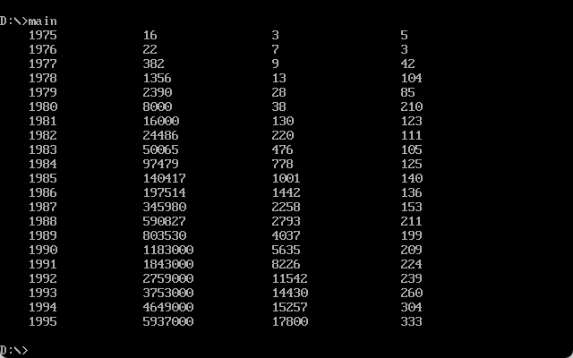

# SALARY

同济大学 2022级 计算机科学与技术学院 软件工程专业 嵌入式系统方向 汇编语言课程作业

授课教师：王冬青

授课学期：2024-2025年度 秋季学期

2251730 刘淑仪

## 项目概述

该项目由三个主要部分组成：`main.asm`、`display.asm`、`math.asm`。其主要功能是处理一组年份数据，计算每年对应的收入和员工数量的平均值，并以表格形式输出。该项目使用汇编语言编写，基于 DOS 中断进行屏幕输出。

## 文件分析

### 1. `main.asm`

`main.asm` 是程序的主文件，负责数据初始化、数据处理和结果输出。

#### 主要功能：
- **数据段定义**：
  - `YEARS`：包含1975年至1995年的年份数据。
  - `INCOMES`：每年对应的收入数据。
  - `EMPLOYEES`：每年对应的员工数量数据。
- **复制数据**：程序将数据从 `YEARS`、`INCOMES` 和 `EMPLOYEES` 复制到 `TABLE` 数据段中。
- **计算每年收入和员工数量的平均值**：
  - 使用除法操作，计算 `INCOMES` 除以 `EMPLOYEES` 得到的结果，并将其存储在 `TABLE` 中。
- **表格输出**：
  - 输出格式为：年份、收入、员工数和平均值，以表格形式显示。

#### 关键部分：
- **数据复制**：通过 `MOVSB`、`MOV` 等指令将数据复制到 `TABLE` 中。
- **计算平均值**：通过 `DIV` 指令计算每年的收入和员工数量的平均值。
- **表格输出**：通过调用 `DISPLAY_TAB`、`DISPLAY_NUMBER` 和 `DISPLAY_NEWLINE` 打印数据。

#### 问题和改进：
- **内存偏移**：在复制数据时，指针的偏移量需要精确计算，以避免数据覆盖。
- **除法逻辑**：在 `DIVIDE_DOUBLEWORD` 中的除法可能需要更详细的注释和修正，尤其是在处理 32 位数据时。
- **输出格式**：需要检查输出是否对齐，避免表格输出混乱。

### 2. `display.asm`

`display.asm` 文件包含显示功能，用于通过 DOS 中断 `21h` 输出数据。

#### 主要功能：
- **`DISPLAY_NUMBER`**：将一个数字转换为字符串并显示，使用 `DIVIDE_DOUBLEWORD` 将数字逐位分割，然后显示。
- **`DISPLAY_TAB`**：打印一个制表符（即四个空格），用于表格格式化。
- **`DISPLAY_NEWLINE`**：打印换行符，用于换行。

#### 关键部分：
- **数字显示**：使用 `DIVIDE_DOUBLEWORD` 将数字按位转换并打印每个数字字符。
- **控制输出格式**：通过打印空格和换行符来控制表格的格式和对齐。

#### 问题和改进：
- **性能问题**：`DISPLAY_NUMBER` 在每次调用时都要进行除法运算，效率较低。可以考虑优化。
- **错误处理**：没有明显的错误处理逻辑，如果数字过大，可能导致输出错误。

### 3. `math.asm`

`math.asm` 文件包含数学计算功能，提供了除法操作。

#### 主要功能：
- **`DIVIDE_DOUBLEWORD`**：对一个 32 位的数值（由 `DX:AX` 组成）进行除法运算，除以一个 16 位的数值。计算结果存储在 `AX` 中，余数存储在 `CX` 中。

#### 关键部分：
- **除法操作**：使用 `DIV` 指令对 32 位数值进行除法，分两步进行（先除以 `CX`，然后结果除以 `CX`）。

#### 问题和改进：
- **除法顺序**：对于 32 位数的除法逻辑较为复杂，可能需要进一步优化或注释说明，确保逻辑的清晰性。

## 最终结果

