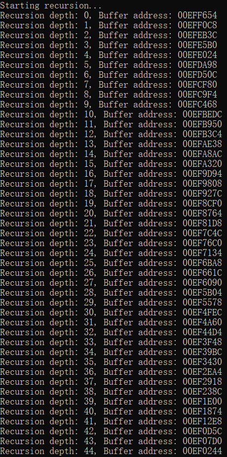

# 编译器对栈的使用分析

操作系统： Windows11
编译工具：Microsoft Visual Studio 2022

同济大学 2022级 计算机科学与技术学院 软件工程专业 嵌入式系统方向 汇编语言课程作业

授课教师：王冬青

授课学期：2024-2025年度 秋季学期

2251730 刘淑仪

## 问题1：系统程序内存空间分布情况，如代码部分、全局变量部分、堆区、栈区等排列顺序

### 源代码
```c
#include <stdio.h>
#include <stdlib.h>

// 全局变量（已初始化）
int global_var = 42;

// 未初始化的全局变量
int uninitialized_var;

// 栈区变量
void print_addresses() {
    int local_var = 10;  // 栈变量

    // 在堆上分配内存
    int* heap_var = (int*)malloc(sizeof(int));
    if (heap_var == NULL) {
        printf("内存分配失败\n");
        return;
    }

    *heap_var = 100;

    // 输出各个区域的地址
    printf("代码段地址: %p\n", (void*)print_addresses);
    printf("全局变量地址: %p\n", (void*)&global_var);
    printf("未初始化全局变量地址: %p\n", (void*)&uninitialized_var);
    printf("栈区地址: %p\n", (void*)&local_var);
    printf("堆区地址: %p\n", (void*)heap_var);

    // 释放堆内存
    free(heap_var);
}

int main() {
    print_addresses();
    return 0;
}
```

### 程序输出


### 输出分析

**各个内存区域内容分析**：

**代码段地址: 00E413F2**
- 说明：print_addresses 函数的地址位于代码段（Text Segment）中。
- 分析：

    代码段存储的是程序的可执行代码，即程序的所有函数和指令。它是一个只读区域，通常位于内存的高地址区域。

    在此例中，00E413F2 是 print_addresses 函数的地址，它位于程序的代码段中，通常是程序中较高的内存地址。

**全局变量地址: 00E4A014**
- 说明：global_var 是初始化的全局变量，存储在数据段（.data）中。
- 分析：
    
    数据段用于存储所有已初始化的全局变量和静态变量。在程序启动时，这些变量会被分配内存并初始化。

    00E4A014 是 global_var 的地址，表明它位于数据段内。数据段通常紧接着代码段，且其地址会稍低于代码段。

**未初始化全局变量地址: 00E4A1AC**
- 说明：uninitialized_var 位于 BSS 段。
- 分析：

    BSS 段存储未初始化的全局变量和静态变量。这些变量在程序启动时会被操作系统初始化为零。

    00E4A1AC 是 uninitialized_var 的地址，显示它位于 BSS 段。BSS 段通常紧接数据段，并且其地址紧挨着已初始化变量的地址。

**栈区地址: 003DF8AC**
- 说明：local_var 是函数内的局部变量，存储在栈区。
- 分析：
    
    栈区用于存储函数的局部变量、函数的参数和返回地址。栈区的地址通常从高到低增长，即随着函数调用，栈区的地址会逐渐减少。

    003DF8AC 是 local_var 的地址，表示它位于栈区。栈区通常位于内存的低地址区域，且随着程序运行，栈区的地址会向低地址方向扩展。

**堆区地址: 0087F648**
- 说明：malloc 动态分配的内存地址，位于堆区。
- 分析：

    堆区用于动态内存分配，分配的内存会根据程序需要随时增加。堆区的地址通常在栈区的下方，向高地址方向增长。

    0087F648 是 malloc 返回的堆区地址，表示动态分配的内存位于堆区。堆区的内存地址在栈区之下，并且随着内存分配的进行，堆区的地址会向高地址方向扩展。

**程序内存空间从高到低的排列顺序**：
1. **代码段（Text Segment）**：存储程序的可执行代码。地址：00E413F2（最高地址）。

2. **数据段（Data Segment）**：存储已初始化的全局变量。地址：00E4A014，紧接代码段下方。

3. **BSS 段**：存储未初始化的全局变量，程序启动时会被操作系统初始化为零。地址：00E4A1AC，紧接数据段下方。

4. **堆区（Heap）**：动态分配内存（通过 malloc 等函数）。地址：0087F648，堆区的地址通常低于栈区，向高地址扩展。

5. **栈区（Stack）**：存储局部变量、函数参数、返回地址等。栈的地址随着函数的调用向低地址方向增长。地址：003DF8AC（最低地址）。


## 问题2：系统栈空间默认多大？如何修改？

### 源代码
```c
#include <stdio.h>

void recursive_function(int depth) {
    char buffer[1000];  // 申请一定大小的局部数组以增加栈空间消耗
    printf("Recursion depth: %d, Buffer address: %p\n", depth, buffer);

    // 递归调用
    if (depth < 10000) {  // 限制递归深度避免栈溢出前退出
        recursive_function(depth + 1);
    }
}

int main() {
    printf("Starting recursion...\n");
    recursive_function(0);
    return 0;
}
```

### 程序输出




### 分析
观察递归函数运行时的栈变量地址输出，总结规律如下：

1. 地址变化方向：

- 每次递归调用，buffer 的地址逐渐减小。这表明栈的分配方向是从高地址向低地址增长（这是大多数平台上栈的增长方式）。

2. 地址变化步长：

- buffer 的地址从一个递归调用到下一个递归调用，减小的幅度接近 1000 字节（buffer 的大小），但略多于 1000 字节。
- 额外的减少部分是因为除了 buffer 的内存分配，还存在函数调用的其他开销，例如保存函数的返回地址、寄存器等。

3. 总栈空间的限制：

- 在某一递归深度时，buffer 地址最终触及系统栈的下界（低地址处），导致栈溢出或无法继续分配，程序停止运行。

4. 递归深度与栈空间的关系：

- 单次递归调用消耗约 4 KB（4112 字节） 栈空间。
- 通过观察最大递归深度，结合每次递归调用的栈消耗，可以估算系统栈空间总大小。

修改栈的大小（Visual Studio中）： 

程序使用 `Visual Stdio` 编译，要在 `Visual Studio` 中查看当前项目的栈大小设置：
1. 右键项目 -> 属性
2. 链接器 -> 系统 -> 栈保留大小
3. 默认值通常是 1MB（1048576 字节）


## 问题3：课堂作业

### 源程序
```c
#include <stdio.h>

void innerFunction() {
    printf("inner function.\n");
}

void outerFunction() {
    printf("outer function.\n");
    innerFunction();  // 调用内层函数
}

int main() {
    outerFunction();  // 调用外层函数
    return 0;
}
```

### 反汇编代码


### 分析
**栈调用关系分析**
1. `main()` 函数

    在 `main()` 的反汇编代码中：

    - push ebp 和 mov ebp, esp：保存调用者的栈帧，建立当前栈帧。
    - sub esp, 0C0h：分配本地变量的栈空间（192 字节）。
    - call _outerFunction：调用 outerFunction 时，将返回地址压栈。
    - add esp, 0C0h 和 pop ebp：恢复栈帧。

    调用关系： `main` 调用 `outerFunction`，其调用栈如下：
    1. 分配栈帧：
    - push ebp：保存调用者栈帧指针。
    - mov ebp, esp：设置当前栈帧基准。
    - sub esp, 0C0h：为局部变量分配 192 字节空间。
    2. 调用 outerFunction：
    - call _outerFunction：压入返回地址并跳转。
    3. 恢复栈帧并返回：
    - 恢复栈指针。
    - 弹出 ebp，跳转到返回地址。

2. `outerFunction()` 函数

    在 `outerFunction()` 的反汇编代码中：

    - push ebp 和 mov ebp, esp：保存调用者的栈帧，建立当前栈帧。
    - sub esp, 0C0h：分配本地变量的栈空间（192 字节）。
    - call _printf：调用 printf 时，返回地址压栈。
    - call _innerFunction：调用 innerFunction 时，返回地址压栈。
    - cmp esp, ebp：调试辅助，确保栈帧完整。
    - ret：返回上层调用。

    调用关系： `outerFunction` 调用 `innerFunction`，其调用栈如下：
    1. 分配栈帧：
    - push ebp：保存调用者栈帧指针。
    - mov ebp, esp：设置当前栈帧基准。
    - sub esp, 0C0h：为局部变量分配 192 字节空间。
    2. 调用 printf：
    - 将 printf 的字符串参数压栈。
    - 调用 printf。
    3. 调用 innerFunction：
    - call _innerFunction：压入返回地址并跳转。
    4. 恢复栈帧并返回：
    - 恢复寄存器、栈指针。
    - 弹出 ebp，跳转到返回地址。

3. `innerFunction()` 函数

    在 `innerFunction()` 的反汇编代码中：

    - push ebp 和 mov ebp, esp：保存调用者的栈帧，建立当前栈帧。
    - sub esp, 0C0h：分配本地变量的栈空间（192 字节）。
    - call _printf：调用 printf 时，返回地址压栈。
    - pop ebp 和 ret：返回上层调用。

    调用关系： `innerFunction` 没有再调用其他函数（除了 printf），其栈帧如下：
    1. 分配栈帧：
    - push ebp：保存调用者栈帧指针。
    - mov ebp, esp：设置当前栈帧基准。
    - sub esp, 0C0h：为局部变量分配 192 字节空间。
    2. 调用 printf：
    - 将 printf 的字符串参数压栈。
    - 调用 printf。
    3. 恢复栈帧并返回：
    - 恢复寄存器、栈指针。
    - 弹出 ebp，跳转到返回地址。


4. 栈帧关系总结

从 `main` 到 `outerFunction` 再到 `innerFunction`，栈的调用顺序如下：

1. `main` 先建立自己的栈帧，调用 `outerFunction` 时压入返回地址，进入 `outerFunction`。
2. `outerFunction` 建立自己的栈帧，调用 `innerFunction` 时压入返回地址，进入 `innerFunction`。
3. `innerFunction` 建立自己的栈帧，调用完成后逐层返回，依次恢复栈帧。