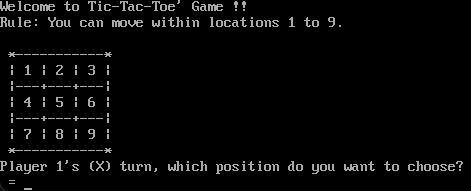
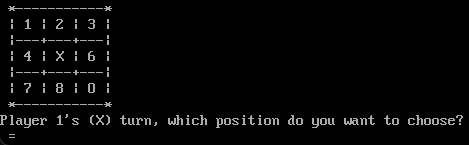
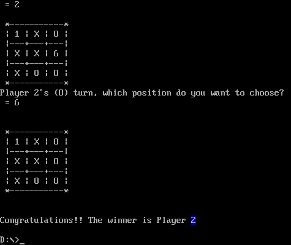
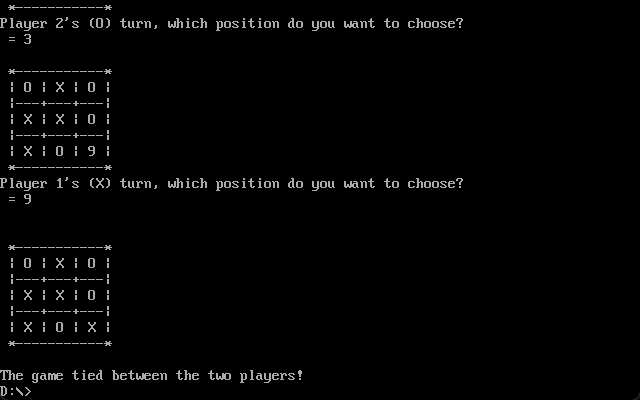

# Final Project : Tic-Tac-Toe

同济大学 2022级 计算机科学与技术学院 软件工程专业 嵌入式系统方向 汇编语言课程作业

授课教师：王冬青

授课学期：2024-2025年度 秋季学期

2251730 刘淑仪

# 项目介绍

井字棋（Tic-Tac-Toe）是一种简单而经典的两人对弈游戏，玩家轮流在3x3的网格中放置自己的标记（通常是“X”和“O”），目标是先将自己的三个标记连成一条线（横线、竖线或对角线）。游戏规则简单，易于上手，但策略性较强，尤其是在双方都熟悉游戏的情况下。

用汇编语言实现井字棋是完全可行的。通过使用一个3x3的数组来表示棋盘状态，利用DOS中断读取用户输入并更新棋盘，检查获胜条件和切换玩家，可以实现一个完整的井字棋游戏。尽管汇编语言的语法较为复杂，但它提供了对硬件的直接控制，适合实现这种简单的游戏逻辑。通过合理的数据结构和游戏逻辑，可以实现一个高效且功能完整的井字棋游戏。

# 项目代码分析

## 数据段 (.DATA)

```asm
.DATA
    grid db '1','2','3','4','5','6','7','8','9' ; 井字棋网格
    player db 0                                  ; 当前玩家（1或2）
    win db 0                                     ; 胜利标志
    welcome db "Welcome to Tic-Tac-Toe' Game !!$"
    separator db " |---+---+---|$"
    rule db "Rule: You can move within locations 1 to 9.$"
    p1turnMessageX db "Player 1's (X) turn, which position do you want to choose?$"
    p2turnMessageO db "Player 2's (O) turn, which position do you want to choose?$"
    tieMessage db "The game tied between the two players!$"
    winMessage db "Congratulations!! The winner is Player $"
    sameDigitError db "ERROR! This place is taken.$"
    zeroError db "ERROR! Input is not a valid digit for the game.$"
    line db " *-----------*$"
```

- `grid`: 保存了井字棋的棋盘状态，最初从字符 '1' 到 '9' 表示每个位置。
- `player`: 当前玩家的标识（1 或 2），1 代表玩家1，2 代表玩家2。
- `win`: 用于标识游戏是否有胜利者，1 表示有胜利者，0 表示没有。
- 其他字符串是用于游戏信息的文本，比如欢迎信息、规则、玩家回合提示、错误提示等。

## 代码段 (.CODE)

代码段中定义了多个子程序（PROCEDURES），这些子程序处理游戏的各个方面，包括输入输出、网格显示、玩家移动的处理、胜负判定等。

### 打印字符串和字符的子程序

#### 打印字符串

```asm
printString PROC
    mov ah, 09h        ; DOS 打印字符串服务
    int 21h
    ret
printString ENDP
```
这个子程序通过调用 `int 21h` 中断，使用 `ah = 09h` 来打印以 `$` 结尾的字符串。在字符串中每遇到 `$` 字符，打印服务就会停止。

#### 打印单个字符

```asm
printChar PROC
    push dx            ; 保存 DX 寄存器的值
    mov ah, 02h        ; DOS 打印字符服务
    int 21h
    pop dx             ; 恢复 DX 寄存器的值
    ret
printChar ENDP
```
这个子程序通过 `ah = 02h` 调用 `DOS` 中断来打印一个字符。字符通过 `dl` 寄存器传入。

#### 打印新行

```asm
newLine PROC
    mov dl, 0dh        ; 回车符
    mov ah, 02h
    int 21h
    mov dl, 0ah        ; 换行符
    mov ah, 02h
    int 21h
    ret
newLine ENDP
```
`newLine` 子程序通过 `int 21h` 打印回车和换行符，从而将光标移动到下一行，效果就是输出新的一行。

### 获取玩家输入与错误处理

#### 获取玩家输入

```asm
getMove PROC
    mov dl, ' '
    call printChar
    mov dl, '='
    call printChar
    mov dl, ' '
    call printChar
    mov ah, 01h        ; DOS 输入字符服务
    int 21h
    call checkValidDigit
    cmp ah, 1
    je contCheckTaken
    mov dl, 0dh
    call printChar
    LEA dx, zeroError
    call printString
    call newLine
    jmp getMove
contCheckTaken:
    LEA bx, grid
    sub al, '1'         ; 将字符转为索引
    mov ah, 0
    add bx, ax          ; 计算位置地址
    mov al, [bx]
    cmp al, '9'
    jng finishGetMove
    mov dl, 0dh
    call printChar
    LEA dx, sameDigitError
    call printString
    call newLine
    jmp getMove
finishGetMove:
    call newLine
    call newLine
    ret
getMove ENDP
```
`getMove` 子程序用来获取玩家的输入。它调用 `int 21h` 来读取一个字符输入，接着调用 `checkValidDigit` 来验证输入是否合法（1-9）。如果输入不合法或该位置已经被占用，它会提示错误并要求重新输入。

#### 错误处理

```asm
checkValidDigit PROC
    mov ah, 0
    cmp al, '1'
    jl validDigit
    cmp al, '9'
    jg validDigit
    mov ah, 1
validDigit:
    ret
checkValidDigit END
```
`checkValidDigit` 用来检查输入的字符是否在合法范围内（'1' 到 '9'）。如果不在这个范围内，它会返回一个错误标志（`ah = 1`）。

### 胜负判定

#### 检查胜利条件

```asm
checkWin PROC
    LEA si, grid
    call checkDiagonal
    cmp win, 1
    je endCheckWin
    call checkRows
    cmp win, 1
    je endCheckWin
    call checkColumns
endCheckWin:
    ret
checkWin ENDP
```

`checkWin` 子程序通过调用 `checkDiagonal`、`checkRows` 和 `checkColumns` 来检查是否有胜利者。如果其中任何一个函数发现胜利条件成立，`win` 被设置为 `1`，表示有胜利者。

#### 检查行、列、对角线是否有胜利者

```asm
checkDiagonal PROC
    ; 从左上到右下的对角线
    mov bx, si
    mov al, [bx]
    add bx, 4
    cmp al, [bx]
    jne diagonalRtL
    add bx, 4
    cmp al, [bx]
    jne diagonalRtL
    mov win, 1
    ret
diagonalRtL:
    ; 从右上到左下的对角线
    mov bx, si
    add bx, 2
    mov al, [bx]
    add bx, 2
    cmp al, [bx]
    jne endCheckDiagonal
    add bx, 2
    cmp al, [bx]
    jne endCheckDiagonal
    mov win, 1
endCheckDiagonal:
    ret
checkDiagonal ENDP
```
`checkDiagonal` 检查两条对角线（从左上到右下和从右上到左下）是否有相同符号（玩家标记相同）。

行和列的检查使用类似的方法，比较每一行和每一列的三个格子是否都是相同字符。如果相同，则设定 `win = 1`，表示胜利者已经产生。

### 游戏逻辑

```asm
MAIN PROC
    ; 初始化
    mov ax, @data
    mov ds, ax
    LEA dx, welcome
    call printString
    call newLine
    LEA dx, rule
    call printString
    call newLine
    ; 游戏循环
gameLoop:
    call printGrid
    LEA dx, p1turnMessageX
    call printString
    call getMove
    call checkWin
    cmp win, 1
    je won
    LEA dx, p2turnMessageO
    call printString
    call getMove
    call checkWin
    cmp win, 1
    je won
    jmp gameLoop
won:
    LEA dx, winMessage
    call printString
    call newLine
    ret
MAIN ENDP
```

`MAIN` 过程是游戏的主逻辑循环，首先显示欢迎信息和规则，然后进入游戏循环（`gameLoop`）。在每个回合中，程序打印棋盘，提示玩家选择位置并获取输入，然后检查是否有玩家胜利。如果有胜利者，跳转到 `won` 标签显示胜利消息。

# 项目实现

## 初始界面



## 玩家下棋



## 有玩家获胜



## 平局



# 反思与总结

## 对于汇编的学习

1. **数据管理与内存操作**：在汇编语言中，程序员需要手动管理内存和数据的存储结构。本项目通过定义 `.DATA` 段来存储游戏数据，展示了如何使用汇编语言管理程序的内存。
2. **输入输出与中断调用**：在汇编中，输入输出操作通常依赖于操作系统提供的中断服务，而本项目通过调用 `int 21h` 中断实现了各种输入输出功能，展示了汇编语言中如何处理用户输入和输出。
3. **流程控制与条件判断**：汇编语言的流程控制依赖于条件跳转和标签，本项目中的代码通过使用这些特性来控制游戏的执行流程。
4. **子程序与模块化**：汇编语言的程序结构通常通过定义多个子程序（如 `printString`、`getMove`、`checkWin` 等）来实现模块化。在本项目中，每个功能都被封装成一个子程序，使得代码的可读性和可维护性有所提高。
5. **手动管理程序状态**：在汇编中，程序状态和标志的管理完全由开发者控制。例如，`win` 变量用于标识游戏是否结束，`player` 变量用于指示当前玩家。每次玩家完成操作后，程序都会修改这些标志变量，从而影响游戏流程。

## 项目总结

### 游戏功能实现：

- 棋盘表示：通过一个包含字符 '1' 到 '9' 的数组来表示棋盘状态，每个位置用数字表示，玩家通过输入数字来选择放置自己的标记（'X' 或 'O'）。
- 玩家轮换：每次回合结束后，玩家的标记会交替（玩家1使用 'X'，玩家2使用 'O'），系统根据当前玩家的输入更新棋盘状态。
输入验证与错误处理：玩家输入的每个位置都需要进行合法性检查，包括判断输入是否在 '1' 到 '9' 之间，是否该位置已被占用等。如果- 输入不符合要求，系统会提示错误并要求重新输入。
- 胜负判定：每回合后，系统会检查是否有玩家获胜。胜利条件是任意一行、列或对角线的三个格子标记相同。如果有玩家胜利，游戏结束；如果棋盘被填满且没有胜利者，判定为平局。

### 代码结构：

- 数据段（.DATA）：存储棋盘的状态、玩家信息、提示信息和错误消息等。
- 代码段（.CODE）：实现了多个功能子程序，包括打印字符串、打印棋盘、获取玩家输入、检查胜负等。整个程序分为多个独立的模块，便于管理和调试。
- 中断调用：程序利用DOS中断（如 int 21h）进行字符输入输出、打印字符串等操作。

### 交互界面：

虽然是基于命令行界面的文本游戏，但通过合理排版和信息提示，用户体验得到了有效的提升。玩家能够清晰地看到游戏进程、当前玩家以及棋盘的状态。

### 项目的扩展性与改进：

1. **图形化界面**：目前的输出是基于文本的，若能够使用图形化界面，玩家体验会更好。
2. **多次游戏支持**：当前程序只能进行一次游戏，若能加入功能支持玩家选择是否重新开始游戏，将更加完善。
3. **AI对战模式**：本项目是基于两位玩家对弈，如果加入AI对战功能，可以进一步提升游戏的复杂度和趣味性。